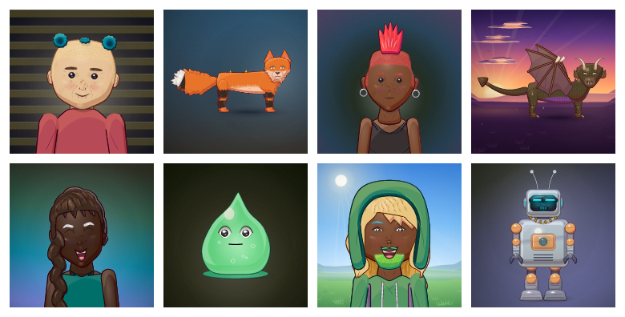
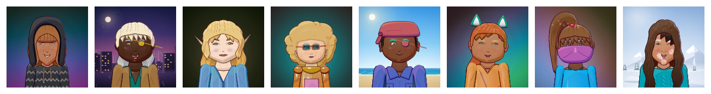
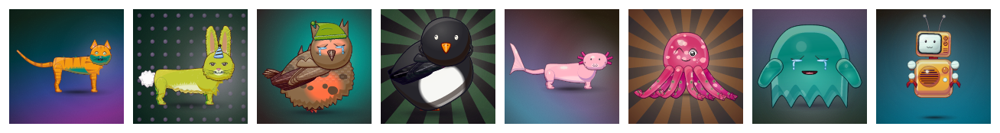
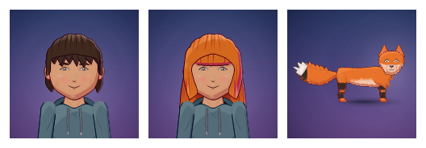

# ArkPlay Avatars

Procedural 2D avatars for games and the web. An avatar is a small JSON document (its **DNA**), and every picture, animation, sprite sheet and rig is a pure function of that DNA. Nothing is stored as art.



This repository is the avatar system's core:

| Package | What it is |
|---|---|
| [`@arkplay/avatar-engine`](packages/avatar-engine) | The engine. DNA schema, share codes, generators, skeleton, poses, 40+ animation clips, SVG renderer, sprite sheets, rigs, animated SVG, stickers and comics. Pure TypeScript, deterministic, no DOM, so it runs in browsers, Node and workers. |
| [`@arkplay/avatar-studio`](packages/avatar-studio) | The React 19 creator UI: a schema-driven editor, randomizer, wardrobe, undo/redo, animation preview, "From photo" and an export dialog for 11 formats. |
| [`@arkplay/avatar-client`](packages/avatar-client) | A typed client for an avatar service, its wire types, and `mountStudio`: the iframe embed with its postMessage protocol. |
| [`@arkplay/avatar-vision`](packages/avatar-vision) | Avatar from a photo, on the device: MediaPipe face landmarks and segmentation, measured colours, an attribute model (ONNX), and a mapping to DNA. The photo never leaves the browser. |
| [`apps/avatar-studio`](apps/avatar-studio) | A standalone and iframe-embeddable studio app (Vite). |

## Quick start

You need Node 22.18 or newer (Node 24 recommended). The packages are TypeScript sources that Node runs directly, so there is no build step.

```bash
npm install
npm run dev          # the studio at http://localhost:5181/avatar/studio/
npm test             # every package
npm run typecheck
```

"From photo" needs the MediaPipe models and runtimes once:

```bash
npm run fetch-models -w @arkplay/avatar-vision
```

## Your first avatar in ten lines

```ts
import { randomDNA, renderSVG, encodeShareCode, decodeShareCode } from '@arkplay/avatar-engine'

const dna = randomDNA({ seed: 42, kind: 'humanoid', theme: 'fantasy' })
const svg = renderSVG(dna, { crop: 'portrait', size: 256 })   // an SVG string
const code = encodeShareCode(dna)                            // "A2…", about 250 characters
const same = decodeShareCode(code)                           // the same avatar, forever
```

The same seed gives the same avatar on every machine and in every runtime. See [Getting started](docs/getting-started.md) for PNG output, editing and animation.

## Examples

Every image on this page is rendered from code by [`examples/render-examples.ts`](examples/render-examples.ts) (`npm run examples`).

**Themes.** `randomDNA({ seed, theme })` rolls a themed outfit, hair and palette.



**Creatures.** 40+ species presets, from cats and dragons to slimes and robots, each with its own body plan and gait.



**Expressions.** 30+ presets, available to stills and animation.


**Views and crops.** Front, side and back; full body, bust, head or portrait.


**Animation.** Clips play the same in every export. This one is an animated SVG:


**Sprite sheets for games.** One row per clip, a fixed pivot at the feet, and TexturePacker JSON ([`spritesheet.json`](docs/images/spritesheet.json)):


**Editing.** Edits are immutable and always return valid DNA:



```ts
import { defaultDNA, setParam, applySpecies } from '@arkplay/avatar-engine'

let dna = defaultDNA('humanoid', 7)
dna = setParam(dna, 'hair', 'style', 'bob')
dna = setParam(dna, 'hair', 'color', '#d2691e')
const fox = applySpecies(defaultDNA('creature', 7), 'fox')
```

## Guides

| Guide | Read it to |
|---|---|
| [Getting started](docs/getting-started.md) | render, edit, share and animate avatars in Node or the browser |
| [Avatar DNA and share codes](docs/dna.md) | understand the data model, its rules and the A2 share-code format |
| [Rendering](docs/rendering.md) | use views, crops, quality, expressions, poses and motion |
| [Exports and animation](docs/exports.md) | make sprite sheets, rigs, animated SVG, GIF, stickers and comics, and pick clips |
| [The React studio](docs/studio.md) | put the full creator UI in a React app, and wire saving, uploads and premium items |
| [Embedding the studio](docs/embedding.md) | put the studio on any page (or a game's web shell) with an iframe |
| [The service client](docs/client.md) | talk to an avatar service: saves, profiles, image URLs |
| [Avatar from a photo](docs/photo-avatars.md) | turn a photo into an avatar, privately, in the browser |
| [Adding content](docs/adding-content.md) | add items, species, clips, themes or expressions without breaking saved avatars |

Each package also has its own README with its API and rules.

## Principles

- **An avatar is its DNA.** Images, sprite sheets and rigs are derived, never stored.
- **Defaults and ids are frozen forever.** Share codes store only the differences from the defaults, so changing a default would change every avatar ever made. Add, never rename.
- **Deterministic.** No `Math.random` in the engine: all randomness goes through seeded RNG forks, so the same DNA renders byte-identical SVG everywhere.
- **No DOM in the engine.** SVG strings only, so the same code runs in the studio, a worker, Node or a service.
- **Private by design.** The studio stores drafts only on the device (and only if the host allows it). "From photo" analyses the photo in memory, in the browser, and keeps nothing but the chosen DNA.

## Free and premium items

Paid, limited and NFT items are part of the schema (so their ids and share codes work everywhere), but their art is not in this repository. Without it, the engine draws a neutral placeholder in their place, and the studio can show an avatar service's drawing of them instead. See [The React studio](docs/studio.md#premium-items).

## Repository layout

```
packages/avatar-engine    the engine (src/, test/, scripts/ for the gallery and the share-code codebook)
packages/avatar-studio    React studio (src/, styles in src/styles/studio.css)
packages/avatar-client    service client, wire types, iframe embed
packages/avatar-vision    avatar from a photo (src/, demo/, models/, fixtures/ of synthetic QA photos)
apps/avatar-studio        standalone + embeddable studio app
examples/                 runnable examples and the README images
docs/                     guides
```

Source rules: imports carry explicit `.ts`/`.tsx` extensions, types come in through `import type`, and there are no enums, namespaces or parameter properties (Node's type stripping runs the files directly). Every `tsconfig.json` extends `tsconfig.base.json`.

## Licence

Proprietary. Copyright © Tsion Ark. All rights reserved. Third-party runtimes and models keep their own licences (MediaPipe: Apache-2.0; onnxruntime-web: MIT); see `packages/avatar-vision/models/manifest.json`.
