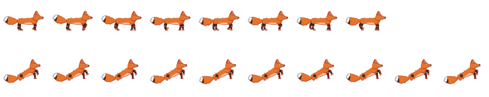

# Exports and animation

Every export is produced by `@arkplay/avatar-engine`, as SVG. The studio's export dialog offers all of them in the browser (`exportAvatar` from `@arkplay/avatar-studio`), and a server can make the same files with the engine and resvg.

| Format | Engine call | Studio format id |
|---|---|---|
| Still image | `renderSVG` | `svg`, `png`, `webp`, `jpeg`, `pixel` |
| Animated SVG | `animatedSVG` | `animated-svg` |
| GIF, WebM | frames from `sampleAnim` | `gif`, `webm` |
| Sprite sheet | `spriteSheet` | `spritesheet` (zip) |
| Rig (skeletal cut-out) | `rigBundle` | `rig` (zip) |
| Sticker pack | `stickerSet`, `renderSticker` | `stickers` (zip) |
| Comics, effects | `renderComic`, `applyEffect`, `renderWithEffect` | |

Runnable: `node examples/node/game-assets.ts` writes a sprite sheet, a rig and an animated SVG to `examples/out/`.

## Still images

`renderSVG(dna, options)`: see [Rendering](rendering.md). The studio makes PNG, WebP and JPEG through a canvas, GIF with gifenc and WebM with MediaRecorder. Pixel-art mode renders tiny and scales up with nearest-neighbour. Raster exports inline uploaded art as data URLs first, because remote images would taint the canvas.

## Sprite sheet (for any 2D engine)



`spriteSheet(dna, { anims, view, cell, columns, pad, fps, maxFrames })` returns `{ svg, width, height, meta }`. The studio's zip holds three files:

| File | Contents |
|---|---|
| `sheet.png` | The grid. By default there's one row per animation, the columns are frames, and cells are square (`cell` px, default 256) |
| `sheet.json` | TexturePacker "hash" format (`frames`, `animations`, `meta`) plus an `arkplay` block |
| `sheet.svg` | The same sheet as vector art |

The `arkplay` block contains:

```jsonc
"arkplay": {
  "format": "arkplay-spritesheet", "version": 1,
  "engine": "arkplay-avatar-engine/1.3.0", "dna": "<dnaHash>",
  "cell": { "w": 256, "h": 256 },
  "pivot": { "x": 0.5, "y": 0.9 },        // 0..1 from the cell's top-left: where the feet touch the ground
  "pixelsPerUnit": 0.31,                   // sheet pixels per world unit (~200 world units ≈ 1 m)
  "unityPPU": 142,                         // suggested Unity Pixels Per Unit (default avatar ≈ 1.8 units tall)
  "animations": [
    { "name": "walk", "view": "side", "fps": 12, "loop": true, "duration": 1.0,
      "frames": ["walk_00", "…"], "events": [{ "frame": 3, "name": "footstep" }],
      "travel": 180 }                      // world units moved per loop: move the character this far per cycle
  ]
}
```

All animations share one bounding box, so the pivot is identical across the whole sheet and characters don't jitter between clips. A real example: [`images/spritesheet.json`](images/spritesheet.json).

## Rig bundle (skeletal cut-out animation)

`rigBundle(dna, { view, clips, scale, faces })` returns `{ bundle, atlasSvg }`. The studio's zip holds `atlas.png` and `rig.json`.

- **`bones`:** the skeleton at rest (`name`, `parent`, `x`, `y`, `rot` in degrees, `len`, y pointing down).
- **`regions`:** each part rendered alone into the atlas, with the bone's pivot (`px`, `py`) inside it. A region holds everything the part paints, plus a margin; a test fails if any art reaches a region's edge.
- **`slots`:** which region sits on which bone, in draw order. Face and hand slots list a region per state (`faceVariants`: neutral, happy, blink, talkA/E/O/M, surprised, sad, angry, laugh, love, hurt, sleep, dizzy; `handVariants`: relaxed, open, fist, point, hold, wave, peace, thumb).
- **`clips`:** bone channels (`rot`, `x`, `y`, `sx`, `sy`) sampled at the clip's fps, plus a face-state track, hand tracks and events.

This works in any engine that has sprites and transforms: Unity, Godot, Phaser, Pixi, or Spine-style runtimes.

## Animated SVG



`animatedSVG(dna, { anim, fps, maxFrames, once, ...RenderOptions })` returns a self-contained SVG animated with CSS keyframes, for chat, web pages and READMEs. Frame 0 is the static fallback, the animation stops under `prefers-reduced-motion`, and there is no script.

## Frames for your own encoder

`sampleAnim(buildModel(dna), clip, { fps, maxFrames, ...RenderOptions })` and `sampleAnims` return the SVG frames of a clip with their times, which is how the studio builds GIF and WebM.

## Animation clips

Every export plays the same clips (`packages/avatar-engine/src/anim/`). A clip's name, duration, fps and looping come from one table, `CLIPS` (`anim/clips.ts`), and are the same for every avatar, so a GIF, a sprite sheet, a rig and the studio's scrubber agree on a clip's frames. The motion is built per avatar:

- **Feet are placed, not swung.** A clip says where each foot goes (planted, lifted in an arc, tucked under the hips) and two-bone IK (`anim/ik.ts`) turns that into rotations for the avatar's own leg lengths. Planted feet never slide: in a walk or run the planted foot moves back exactly `travel / duration` per second, so a game that moves the avatar at that speed gets no foot sliding. The hips ride as high as every foot target allows, which is where the walk's bob comes from. Front and back views foreshorten thighs and shins instead.
- **Humanoid bodies change the motion** (`anim/profile.ts`): heavy builds take shorter steps with more side-to-side weight shift, big-headed (chibi) avatars bounce, old ones lean forward and swing their arms less. Stride scales with leg length. Each avatar's seed also varies idle timing, the fidget it picks and where it blinks, so a crowd doesn't move in lockstep.
- **Creature motion comes from anatomy.** The body plan and parts pick a gait (table below); the DNA param `species.gait` (Natural / Walks / Hops / Waddles / Floats) overrides it. Emotes use what the body has: a cat sits up to wave a paw, a bird waves a wing, a fish its tail, a robot its arm, an octopus a tentacle, a snake rears up like a cobra.
- **Secondary motion** (`anim/secondary.ts`): hair, capes, skirts, tails, wings and tentacles react to what their attachment point does in the clip a moment earlier. They lag a turn, lift when the body drops, swing against sideways acceleration and trail behind travel, plus a small sway that loops cleanly. It is pose data only (a few skeleton evaluations per frame, under 0.15 ms), so it bakes into sprite sheets and rig clips like everything else. Clips that flap wings themselves list them in `owns`.
- **Loops are seamless** and one-shots settle back to rest in their last frames (except `ko` and `jump-up`, which end in a held pose). The engine tests check every clip on every species and several humanoid bodies for this, for finite transforms, for feet that stay planted and above the floor, and for catalogue timing.

`clipsFor(kind)` lists every clip of a kind: all of them play for any avatar of that kind. `clipsForAvatar(dna)` lists the ones that suit a particular body, for menus: a wingless cat has no `fly`, a fish no `slither`.

### Catalogue

Frames are at the clip's own fps; one-shots include their last pose. Nothing goes over 36 frames, the animated SVG and GIF limit.

| Clip | Label | | Seconds | fps | Frames | Kinds | Tags |
|---|---|---|---|---|---|---|---|
| `idle` | Idle | loop | 2.4 | 12 | 29 | both | core |
| `idle-look` | Look around | loop | 3 | 10 | 30 | both | idle |
| `idle-fidget` | Fidget | loop | 2.4 | 12 | 29 | both | idle |
| `yawn` | Yawn & stretch | once | 2 | 12 | 24 | both | idle, rest |
| `blink` | Blink | once | 0.3 | 20 | 6 | both | face |
| `talk` | Talk | loop | 1.8 | 14 | 25 | both | face, core |
| `walk` | Walk | loop | 1 | 12 | 12 | both | core, locomotion |
| `run` | Run | loop | 0.62 | 14 | 9 | both | core, locomotion |
| `jump` | Jump | once | 1 | 16 | 16 | both | core, locomotion |
| `jump-up` | Jump take-off | once | 0.5 | 16 | 8 | both | locomotion, jump |
| `fall` | Fall | loop | 0.8 | 12 | 10 | both | locomotion, jump |
| `land` | Land | once | 0.5 | 16 | 8 | both | locomotion, jump |
| `hover` | Hover | loop | 1.6 | 12 | 19 | both | locomotion, air |
| `flap` | Wing flap | loop | 0.5 | 16 | 8 | both | locomotion, air, emote |
| `glide` | Glide | loop | 1.6 | 12 | 19 | both | locomotion, air |
| `fly` | Fly | loop | 0.6 | 16 | 10 | creature | locomotion, air |
| `swim` | Swim | loop | 1.2 | 12 | 14 | creature | locomotion |
| `slither` | Slither | loop | 1.4 | 12 | 17 | creature | locomotion |
| `hop` | Hop | loop | 0.9 | 14 | 13 | creature | locomotion |
| `wave` | Wave | loop | 1.2 | 14 | 17 | both | emote |
| `cheer` | Cheer | loop | 0.9 | 14 | 13 | both | emote |
| `dance` | Dance | loop | 1.6 | 14 | 22 | both | emote, dance |
| `dance-hop` | Party hop | loop | 1 | 14 | 14 | both | emote, dance |
| `dance-sway` | Sway | loop | 2 | 12 | 24 | both | emote, dance |
| `clap` | Clap | loop | 0.5 | 16 | 8 | both | emote |
| `nod` | Nod yes | loop | 0.9 | 14 | 13 | both | emote |
| `shake-head` | Shake head | loop | 0.9 | 14 | 13 | both | emote |
| `laugh` | Laugh | loop | 1.2 | 14 | 17 | both | emote |
| `cry` | Cry | loop | 1.6 | 12 | 19 | both | emote |
| `angry` | Stomp | loop | 1 | 14 | 14 | both | emote |
| `love` | Love | loop | 1.6 | 12 | 19 | both | emote |
| `surprise` | Surprise | once | 0.8 | 16 | 13 | both | emote |
| `shrug` | Shrug | once | 1.4 | 14 | 20 | humanoid | emote |
| `think` | Think | loop | 2.4 | 10 | 24 | humanoid | emote |
| `bow` | Bow | once | 1.4 | 14 | 20 | both | emote |
| `victory` | Victory | loop | 1.1 | 14 | 15 | both | emote, result |
| `defeat` | Defeat | loop | 2 | 10 | 20 | both | emote, result |
| `wag` | Tail wag | loop | 0.5 | 16 | 8 | creature | emote |
| `attack` | Attack | once | 0.6 | 18 | 11 | both | combat |
| `cast` | Cast spell | loop | 1.2 | 14 | 17 | humanoid | combat |
| `hurt` | Hurt | once | 0.5 | 18 | 9 | both | combat |
| `ko` | Knocked out | once | 1.2 | 16 | 19 | both | combat |
| `sit` | Sit | loop | 2.4 | 10 | 24 | both | rest |
| `sleep` | Sleep | loop | 3 | 10 | 30 | both | rest |

Clip names never change meaning; new clips are added.

**Platformer jumps.** Play `jump-up` when the jump starts (crouch, push off, ends rising with the arms up), loop `fall` while airborne, then `land` on touchdown (absorb, rebound, settle). `jump` is the whole arc in one clip, for games that don't simulate it.

**Events** (sprite-sheet `events[].frame`, rig `events[].t`): `footstep` (walk, run), `takeoff`, `land`, `tap` (fidgets), `beat` (dances), `clap`, `stomp`, `hit`, `thud`.

**Travel** is world units per loop for clips that move (`walk`, `run`, `glide`, `fly`, `swim`, `slither`, `hop`, a floater's `walk`); everything else is in place.

### Gaits by body

| Body | `walk` / `run` | Notes |
|---|---|---|
| Humanoid | IK walk (57 % stance) / run with a flight phase | Side views swing limbs; front and back views lift knees, shift weight and drop the free hip. |
| Quadruped | Lateral-sequence walk / gallop; tiny ones (mice) take two cycles per loop | The body pitches between front and hind legs. `sit` rests the rump, `victory` rears up, `sleep` lies down with the head forward, `bow` and `yawn` play-bow. |
| Long-eared or squat webbed quadruped (bunny, frog) | Hops (two per walk loop, one bigger per run) | Fore feet reach, hind feet trail then swing through. |
| Bird with webbed feet (penguin, duck) | Waddle: short steps, the body rocking | |
| Small winged bird (owl, parrot) | Two-footed hops | Wings (drawn folded) swing up and down to fly. |
| Big biped (dinosaur) | Striding walk / run, tail swinging | |
| Fish | Tail beats; `run` beats twice | The tail foreshortens as the fin turns. |
| Serpent | Slither: a wave travelling down the body, head held level, belly on the ground | With legs (sky dragon): floats, undulating. Snail: a slow ripple. |
| Bug | Tripod (6 legs) or alternating tetrapod (8) | The leg swings about the hip and squashes to lift. |
| Blob | Squash-and-stretch hops | Ghost, flame and cloud blobs float. |
| Octopus / jellyfish | Arms ripple / the bell pulses and rises | Arms trail the body. |
| Robot | A march, arms swinging | Without legs: rolls (wheels) or hovers (wings). |

A floater (ghost, jellyfish, drone, sky dragon, or any creature with `species.gait: float`) stays in the air through every clip.


## Stickers, comics and effects

- `stickerSet(dna)`: 16 humanoid stickers (an expression plus a pose, like "Hello!" or "Yay!") or 12 creature stickers.
- `renderSticker(templateId, [dna, friendDna?], { size, effect, motion, outline, … })`: a sticker from the catalogue (`stickerCatalogue()`, `STICKER_TEMPLATES`, `STICKER_CATEGORIES`). Some take a friend.
- `renderComic(scriptId, [dna, friendDna?], { layout, width, motion, subtitle, … })`: a short comic strip (`comicCatalogue()`, `COMIC_SCRIPTS`, `dailyComic('2026-10-01')`).
- `applyEffect(svg, effectId, opts)` puts an effect around any finished SVG; `renderWithEffect(dna, effectId, renderOptions)` renders an avatar with one around its head. Effects: `sparkles confetti hearts snow rain fire glow halo stars bubbles petals rays` (`EFFECTS`).

## Unity (and other engines) without an SDK

Importing a PNG sprite sheet by hand:

1. Export a sprite sheet from the studio (or with `spriteSheet` and resvg). Unzip it into `Assets/Avatars/<name>/`.
2. Select `sheet.png` and set **Texture Type:** Sprite (2D and UI), **Sprite Mode:** Multiple, **Pixels Per Unit:** `arkplay.unityPPU` from `sheet.json`, **Filter Mode:** Bilinear (for a pixel-art export: Point, and Compression None).
3. Open the **Sprite Editor**, choose **Slice → Grid By Cell Size**, and set **Pixel Size** to `arkplay.cell.w × arkplay.cell.h` and **Pivot** to Custom, `(arkplay.pivot.x, 1 − arkplay.pivot.y)` (Unity's pivot origin is bottom-left). Press **Slice** and **Apply**.
4. Each row is one clip, in `arkplay.animations` order. Drag a row's sprites into the Scene to create an AnimationClip; set its **Sample Rate** to the animation's `fps` and **Loop Time** to match `loop`.
5. Movement: for walk and run, move the transform `travel × pixelsPerUnit / unityPPU` Unity units per loop, so the feet don't slide.
6. Events: `events[].frame` gives the frame for Animation Events such as footsteps.

`sheet.json` is standard TexturePacker "hash" JSON, so any TexturePacker importer can slice it automatically instead of step 3.
