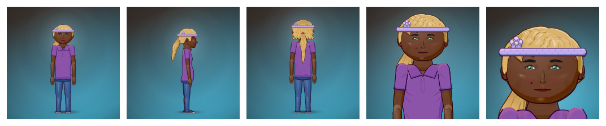
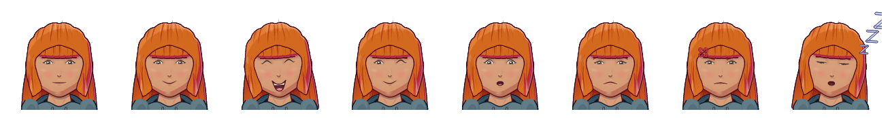

# Rendering

`renderSVG(dna, options)` turns DNA into an SVG document string. It has no DOM dependency, so the same call works in a browser, a Web Worker, Node or a server.

```ts
import { renderSVG } from '@arkplay/avatar-engine'

renderSVG(dna)                                                   // front view, fit crop, high quality
renderSVG(dna, { crop: 'portrait', size: 96 })                   // a profile picture
renderSVG(dna, { view: 'side', crop: 'fit', background: false }) // a transparent side view
renderSVG(dna, { expression: 'laugh', pose: 'peace' })           // override face and pose
renderSVG(dna, { anim: 'run', time: 0.3 })                       // one frame of a clip
```



## Options

| Option | Values | Default |
|---|---|---|
| `view` | `front`, `side`, `back` | `front` |
| `crop` | `full` (fixed world frame, same scale for every avatar of a kind: game sprites), `fit` (tight), `bust`, `head`, `portrait` (head a little above centre, room for a circular frame) | `fit` |
| `size` | output width in px (height follows the crop); only sets the `width`/`height` attributes | none |
| `background`, `frame`, `effects`, `shadow` | switch the scene background, the frame, auras and particles, and the ground shadow | on / the DNA |
| `expression` | an expression preset id (`EXPRESSION_PRESETS`) | the DNA's |
| `pose` | a pose id (`POSE_DEFS`) | the DNA's |
| `anim`, `time` | a clip name and a time in seconds | none |
| `flip` | mirror horizontally | `false` |
| `idPrefix` | prefix for every SVG id; fix it for byte-identical output | a fresh prefix per render |
| `padding` | extra room around the crop, as a fraction of its size | 0 |
| `detail` | `low`, `medium`, `high`: the art style's detail level; `low` suits small images | the DNA's |
| `quality` | `high` (rich lighting and materials, for stills) or `standard` (lighter, for animation frames) | `high` for stills, `standard` with `anim` |
| `motion` | looping CSS animation of auras, effects and scene particles in a still | on for `high` stills |
| `viewBox` | override the crop box (world units) | none |
| `title` | a `<title>` for accessibility, or `false` | the avatar's name |
| `assetUrl` | resolves an uploaded custom-art id to an image URL | none (such art is skipped) |

## Expressions and poses



- **Expressions** (`EXPRESSION_PRESETS`): `neutral happy grin laugh smirk excited love wink tongue cool smug determined surprised shocked sad cry worried scared angry furious pout embarrassed confused bored sleepy dizzy sick mischief`, plus sticker faces.
- **Poses** (`POSE_DEFS`): `stand relaxed hands-hips wave peace thumbs-up point cheer arms-crossed think shrug flex salute fight cast heart sit run jump`, plus sticker poses.
- Creatures get stances too (`creaturePose`): sit, lie, rear, bow and more.

## Several avatars on one page

Inline SVG ids and `<style>` blocks are global to an HTML document. Each `renderSVG` call gets a fresh id prefix (`av0`, `av1`…), and motion CSS is scoped to it, so any number of avatars can share a page. Pass a fixed `idPrefix` only when you need deterministic output (caching, tests, golden files).

## Quality and cost

For a typical full avatar:

- `standard`: under about 8 ms per render.
- `high`: SVG generation ≤ 25 ms, document ≤ 400 KB; resvg at 512 px ≤ 500 ms.

Use `standard` for long lists, thumbnails and animation. The studio renders thumbnails at `standard` in a Web Worker pool with an LRU cache.

## Motion in stills

With `quality: 'high'` (the default for stills), auras, effects and scene particles loop through CSS keyframes embedded in the SVG. Browsers play them; `prefers-reduced-motion` stops them; rasterizers such as resvg draw the base frame. Pass `motion: false` to turn it off. Animation exports don't use it: there, the clip's time drives the effects.

## Rasterizing

- **Node:** `@resvg/resvg-js` (`new Resvg(svg, { fitTo: { mode: 'width', value: 512 } }).render().asPng()`).
- **Browser:** draw the SVG on a canvas (see [Getting started](getting-started.md#2-render-it)), or use the studio's `exportAvatar`, which also makes WebP, JPEG, GIF, WebM and pixel art.

The engine avoids group opacity and culls off-canvas parts, because resvg can crash on fully off-canvas layers that carry opacity, a clip, a mask or a filter. If you add art, keep it that way ([Adding content](adding-content.md)).

## Lower-level building blocks

`buildModel(dna)` resolves the skeleton and parts; `layoutFrame`, `partsSVG`, `documentSVG` and `cropBox` compose a frame; `renderModel` renders a prepared model. They are exported for renderers that need them (the exporters use them); most code should call `renderSVG`.
